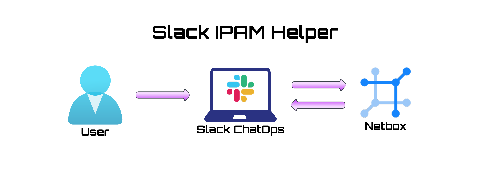
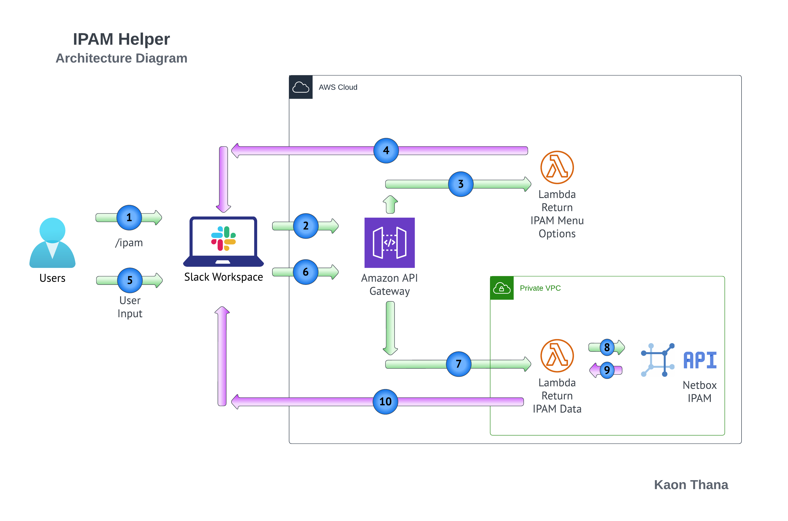

# IPAM Helper

The IPAM Helper Slackbot responds to the slash command **/ipam** in your workspace

The user can select from a pre-defined list of buttons or enter a desired prefix in the form. The input is sent to a Lambda function which makes a call to Netbox for the requested information and returns the data to the user.

### High level Diagram

